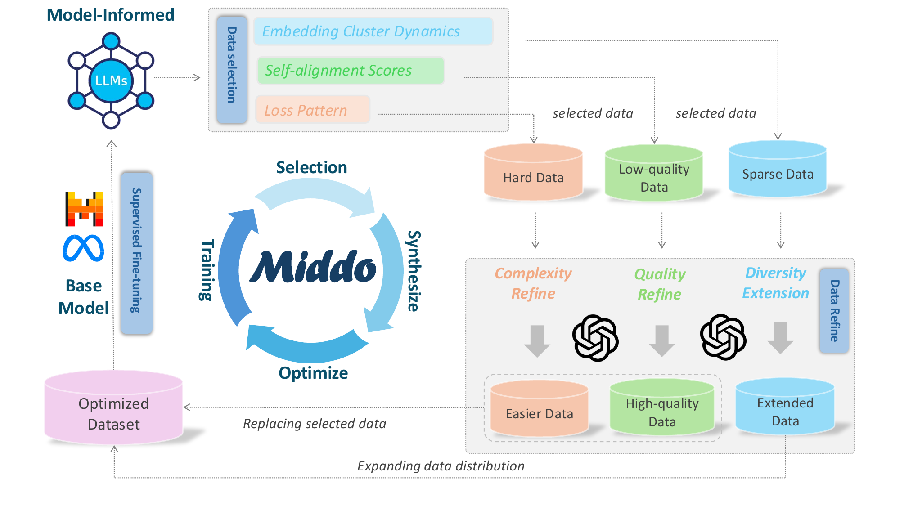
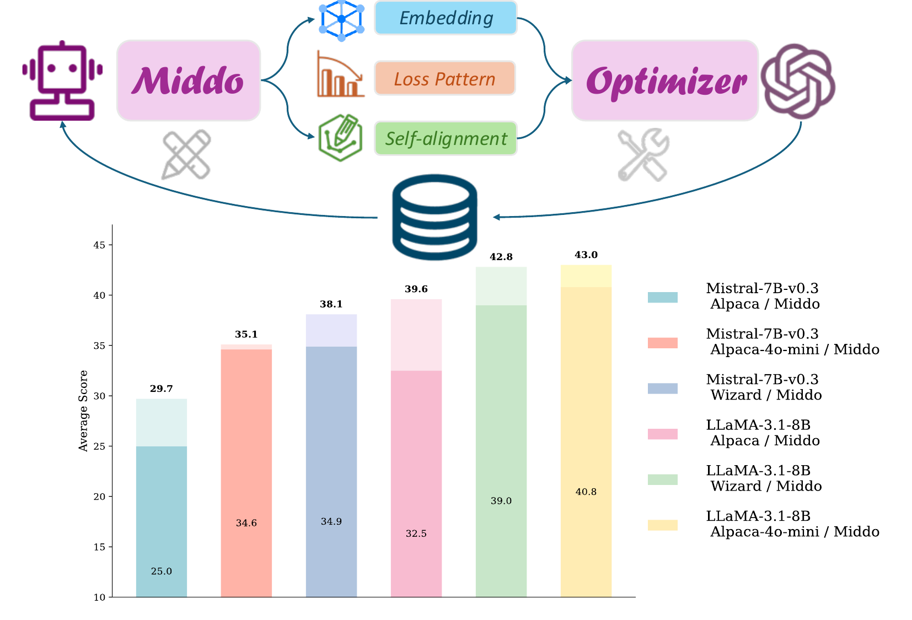

<p align="center">
<h1 align="center">Middo: Model-Informed Dynamic Data Optimization for Enhanced LLM Fine-Tuning via Closed-Loop Learning</h1>

<p align="center">
    <a href="https://arxiv.org/abs/2508.21589"></a>
    <a href="https://github.com/Word2VecT/Middo/blob/main/LICENSE"></a>
    <a href="https://huggingface.co/collections/Word2Li/middo-68c27d3b42f79febf7f6312c"></a>
</p>

🎉🎉 Middo is accepted EMNLP 2025 (Main)! 🎉🎉

We introduce **Middo**, a self-evolving **M**odel-**i**nformed **d**ynamic **d**ata **o**ptimization framework that uses model-aware data selection and context-preserving data refinement. Middo establishes a closed-loop optimization system:

1. A self-referential diagnostic module proactively identifies suboptimal samples through tri-axial model signals - *loss patterns (complexity)*, *embedding cluster dynamics (diversity)*, and *self-alignment scores (quality)*;
2. An adaptive optimization engine then transforms suboptimal samples into pedagogically valuable training points while preserving semantic integrity;
3. This optimization process continuously evolves with model capability through dynamic learning principles.



Middo consistently enhances the quality of seed data and boosts LLM's performance with improving accuracy by $7.15\%$ on average while maintaining the original dataset scale.



We release Midoo optimized datasets (MiddOptimized)、Midoo generated only datasets (MiddOnly) and corresponding models fine-tuned on one of MiddOptimized dataset's split.

| Dataset/Model | Avg. Performance | Improvement | HuggingFace🤗 |
| - | :-: | :-: | :-: |
| MiddOptimized | - | - | [Dataset Link](https://huggingface.co/datasets/Word2Li/MiddOptimized) |
| MiddOnly | - | - | [Dataset Link](https://huggingface.co/datasets/Word2Li/MiddOnly) |
| Llama3.1-8B-Middo-Alpaca | $39.63$ | $7.15$ | [Model Link](https://huggingface.co/Word2Li/Llama3.1-8B-Middo-Alpaca) |
| Llama3.1-8B-Middo-Alpaca-4o-mini | $42.96$ | $2.20$ | [Model Link](https://huggingface.co/Word2Li/Llama3.1-8B-Middo-Alpaca-4o-mini) |
| Llama3.1-8B-Middo-Wizard | $42.80$ | $3.84$ | [Model Link](https://huggingface.co/Word2Li/Llama3.1-8B-Middo-Wizard) |
| Mistral-v0.3-7B-Middo-Alpaca | $29.72$ | $4.75$ | [Model Link](https://huggingface.co/Word2Li/Mistral-v0.3-Middo-Alpaca) |
| Mistral-v0.3-7B-Middo-Alpaca-4o-mini | $35.08$ | $0.52$ | [Model Link](https://huggingface.co/Word2Li/Mistral-v0.3-Middo-Alpaca-4o-mini) |
| Mistral-v0.3-7B-Middo-Wizard | $38.56$ | $3.64$ | [Model Link](https://huggingface.co/Word2Li/Mistral-v0.3-Middo-Wizard) |

## 🎯 Quick Start

Install the dependencies

### 💻 Test System Information

- System: CentOS Linux 7 (Core), no root permission
- Conda: Miniconda 25.7.0
- GNU C Library: ldd (GNU libc) 2.17
- CUDA: release 12.4, V12.4.131

```bash
# Install LLaMA-Factory for training
cd LLaMA-Factory
conda create -n lf python=3.10 -y
conda activate lf
pip install torch==2.6.0 torchvision==0.21.0 torchaudio==2.6.0 --index-url https://download.pytorch.org/whl/cu124
pip install pyarrow==20.0.0 av==14.4.0 deepspeed==0.16.9 soxr==0.5.0.post1 Cython scikit-build-core setuptools_scm
pip install -e ".[torch,metrics]" --no-build-isolation
pip install vllm
pip install https://github.com/Dao-AILab/flash-attention/releases/download/v2.7.4.post1/flash_attn-2.7.4.post1+cu12torch2.4cxx11abiFALSE-cp310-cp310-linux_x86_64.whl

# Install opencompass for evaluation
cd ../opencompass
conda deactivate
conda create -n oc python=3.10 -y
conda activate oc
pip install torch==2.6.0 torchvision==0.21.0 torchaudio==2.6.0 --index-url https://download.pytorch.org/whl/cu124
pip install pyarrow==20.0.0
pip install -e "."
pip install vllm flashinfer-python==0.2.2.post1
git clone git@github.com:open-compass/human-eval.git
cd human-eval && pip install -e .

# Install DataDreamer for data synthetic
cd ../../datadreamer
conda deactivate
conda create -n dd python=3.10 -y
conda activate dd
pip install -r requirements.txt
```

## 📚 Data

View and download all data from huggingface [Word2Li/MiddOptimized](https://huggingface.co/datasets/Word2Li/MiddOptimized) then convert each split to `.json` or `.jsonl` file. Register data in `dataset_info.jsonl` file and edit training yaml script (e.g. [`train_llama.yaml`](scripts/train_llama.yaml)) file according to LLaMA-Factory [Data Preparation](https://github.com/hiyouga/LLaMA-Factory#data-preparation).

## 🤖 Training

Our training codes depend on [LLaMA-Factory](https://github.com/hiyouga/LLaMA-Factory).

```bash
cd LLaMA-Factory
conda activate lf
llamafactory-cli train train_llama.yaml # or train_mistral.yaml
```

## 📊 Evaluation

Our training codes depend on [OpenCompass](https://github.com/hiyouga/LLaMA-Factory). You need to first download the model from HuggingFace, or SFT the model on your own.

```bash
export MODEL_PATH=<your_sft_model_path>
bash scripts/eval_llama.sh # or scripts/eval_mistral.sh
```

## ⚙️ Data Optimization Pipeline

To collect your own Middo data, please refer to the following scripts:

```bash
export PRE_MODEL_PATH=<your_model_path_before_training>
export CURRENT_MODEL_PATH=<your_model_path_after_training>
export DATASET=<dataset_name_listed_in_dataset_info>
export DATASET_PATH=<dataset_path>
export BASE_URL=<your_openai_base_url>
export SKEY=<your_openai_skey>

# Complexity Optimization
bash scripts/complexity_pipeline.sh

# Diversity Optimization
bash scripts/diversity_pipeline.sh

# Quality Optimization
bash scripts/quality_pipeline.sh

# Merge Data
python json_intersection.py complexity_remain.json  quality_remain.json -o remain.json
python json_merge.py remain.json complexity.json diversity.json quality.json  -o optimized.json
```

## 🙏 Acknowledgements

Many thanks to

- [LLaMA-Factory](https://github.com/hiyouga/LLaMA-Factory/tree/main)
- [OpenCompass](https://github.com/open-compass/opencompass)
- [DataDreamer](https://github.com/datadreamer-dev/DataDreamer)

## 📝 Citation

If you find our code, model, or data are useful, please kindly cite our [paper](https://arxiv.org/abs/2508.21589):

```bibtex
@misc{tang2025middomodelinformeddynamicdata,
      title={Middo: Model-Informed Dynamic Data Optimization for Enhanced LLM Fine-Tuning via Closed-Loop Learning}, 
      author={Zinan Tang and Xin Gao and Qizhi Pei and Zhuoshi Pan and Mengzhang Cai and Jiang Wu and Conghui He and Lijun Wu},
      year={2025},
      eprint={2508.21589},
      archivePrefix={arXiv},
      primaryClass={cs.CL},
      url={https://arxiv.org/abs/2508.21589}, 
}
```
